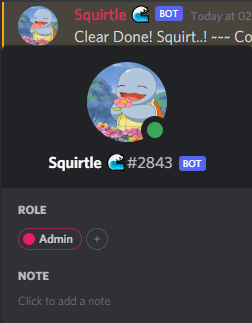

<p><h1 align="center"><a href="#" target="_blank"></a></h1>

<div style="text-align:center"></div>

<p align="center">
  <a href="#" target="_blank"></a>
  <a href="#" target="_blank"></a>
  <a href="#" target="_blank"></a>
</p>

<h4 align="center"\>This repository is a study repository to learn more about JS, API's usage and Discord JS.</p>
</br>

## Index
<p align="center">
🔹 <a href="#about" target="_blank">About</a></br>
🔹 <a href="#functionalities" target="_blank">Functionalities</a></br>
🔹 <a href="#deploy" target="_blank">Deploy</a></br>
🔹 <a href="#requirements" target="_blank">Requirements</a></br>
🔹 <a href="#running" target="_blank">Running</a></br>
🔹 <a href="#tasks" target="_blank">Tasks</a>
</p>

## About
Current this project can play songs, random messages, join/leave the voice call. Using Javascript, JSON, Discord.js and ytdl-core.

## Functionalities
:heavy_check_mark: Play and Stop youtube songs </br>
:heavy_check_mark: Send random message </br>
:heavy_check_mark: Join and Exit of voice channel </br>
:heavy_check_mark: Clear chat messages </br>

## Deploy

<div style="text-align:center"></div>
<div style="text-align:center"></div>
<div style="text-align:center"></div>
</div>

</br>

## Requirements
I was coding it using: ( discordjs | node | ytdl-core ) </br>
[](https://github.com/discordjs/discord.js/)
[](https://github.com/fent/node-ytdl-core)
[](https://nodejs.org/en/)

## Running 
You need create your discord bot on discord website applications and after clone this repository, download and settings of the requirements and to finish, configure your token and prefix on .json file and run.

Clone this repository
```
git clone https://github.com/r1ddax/Sqrt_Bot_Discord.git
```

## Tasks
:memo: Configure, download and study documentation of discord js. </br>
:memo: Planning the bot befero starte code. </br>
:memo: Code the structure of bot. </br>
:memo: Code the commands of bot. </br>
